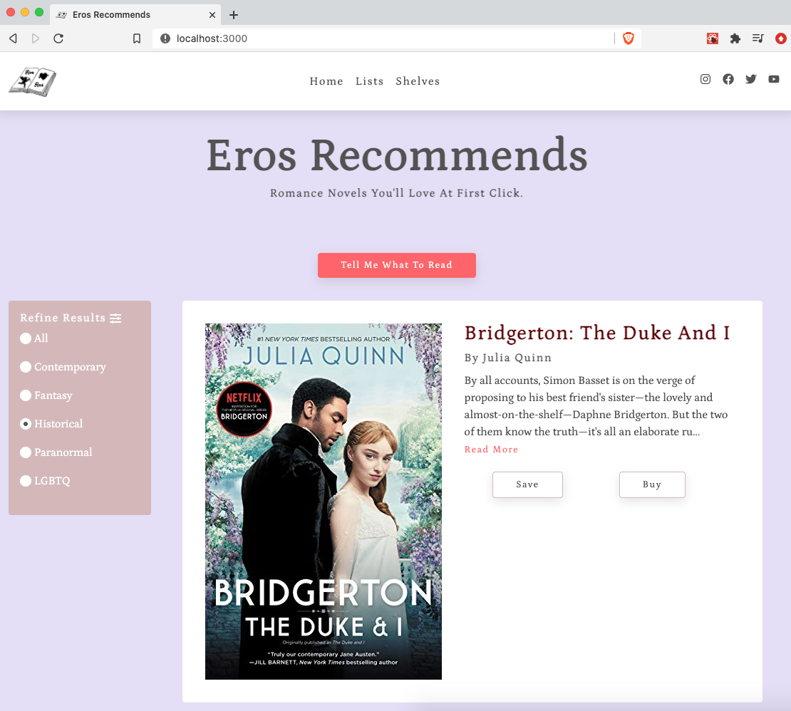

## What is Eros Recommends?

Eros Recommends is a romance novel recommendation website project built by Leslie Williams. It's utilizes React, Node.js, Jest, and Sass.

To run the Eros Recommends application, navigate to the frontend directory and run:

### `npm start`

This runs the app in the development mode. 
Open [http://localhost:3000](http://localhost:3000) to view it in the browser.

The page will reload if you make edits. 
You will also see any lint errors in the console.

To run the backend, navigate to the backend directory and run: 

### `DEBUG=backend:* npm run devstart`

This runs the backend in development mode. 

### `npm test`

Launches the test runner in the interactive watch mode. 

### `npm run build`

Builds the app for production to the `build` folder. 

